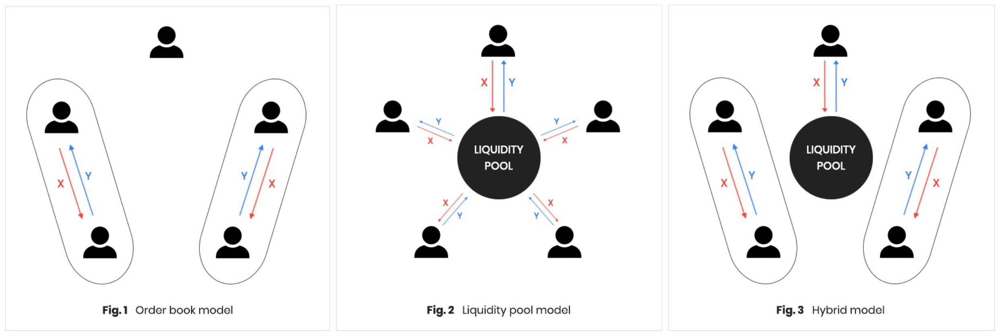

[](https://codecov.io/gh/tendermint/liquidity?branch=develop)

# Liquidity Module
the Liquidity module of the Cosmos-SDK, which serves AMM(Automated Market Makers) style decentralized liquidity providing and coin swap functions.

The module enable anyone to create a liquidity pool, deposit or withdraw coins from the liquidity pool, and request coin swap to the liquidity pool.

This module will be used in the Cosmos Hub, and any other blockchain based on Cosmos-SDK.

- The Cosmos Hub AMM should have strong philosophy of inclusiveness of users from different blockchains because its prime utility is inter-blockchain communication
- To possess such characteristics, the Liquidity module should provide most convenient ways for external users to come in and use the services provided by the Cosmos Hub
- The Liquidity module should not anticipate specific assets, such as Atom, into the process of user-flow in a forced manner. It is repeatedly proved that unnatural anticipation of native coin at unavoidable parts of process resulting in poor user attraction

## Key features



**Combination of Traditional Orderbook-based Model and New AMM Model**

- Although new AMM model has multiple advantages over orderbook-based model,
combination of both models will create more enriched utilities for wider potential users
- We re-define the concept of a “swap order” in AMM as a “limit order with short lifetime”
in an orderbook-based exchange. Then, two concepts from two different models can be
combined as one united model so that the function can provide both ways to participate
into the trading and liquidity providing activities
- Although our first version of the Liquidity module will not provide limit order option, but
the base structure of the codebase is already anticipating such feature expansion in
near future
- Advantages of combined model
    - More freedom on how to provide liquidity : Limit orders
    - Combination of pool liquidity and limit order liquidity provides users more enriched trading environment

For detailed Mechanism, you can find on our recent [Paper](https://github.com/tendermint/liquidity/raw/develop/doc/Liquidity%20Module%20V1%20-%20Mechanism%20Explained.pdf)

## Installation

### Requirements

| Requirement | Notes            |
| ----------- | ---------------- |
| Go version  | Go1.15 or higher |
| Cosmos-SDK  | v0.40.0-rc4      |

### Get Liquidity Module source code 
```bash 
$ git clone https://github.com/tendermint/liquidity.git
$ cd liquidity
$ go mod tidy
```

### Build

```bash 
$ make build 
```
You can find the `liquidityd` binary on `build/`

### Install
```bash 
$ make install 
```

## liquidityd

```bash
Usage:
  liquidityd [command]

Available Commands:


  add-genesis-account Add a genesis account to genesis.json
  collect-gentxs      Collect genesis txs and output a genesis.json file
  debug               Tool for helping with debugging your application
  export              Export state to JSON
  gentx               Generate a genesis tx carrying a self delegation
  help                Help about any command
  init                Initialize private validator, p2p, genesis, and application configuration files
  keys                Manage your application's keys
  migrate             Migrate genesis to a specified target version
  query               Querying subcommands
  start               Run the full node
  status              Query remote node for status
  tendermint          Tendermint subcommands
  testnet             Initialize files for a liquidityapp testnet
  tx                  Transactions subcommands
  unsafe-reset-all    Resets the blockchain database, removes address book files, and resets priv_validator.json to the genesis state
  validate-genesis    validates the genesis file at the default location or at the location passed as an arg
  version             Print the application binary version information

Flags:
  -h, --help          help for liquidityd
      --home string   directory for config and data (default "/Users/dongsamb/.liquidityapp")
      --trace         print out full stack trace on errors
```


### Tx

`$ liquidityd tx liquidity --help`

```bash
Liquidity transaction subcommands

Usage:
  liquidityd tx liquidity [flags]


Available Commands:
  create-liquidity-pool Create Liquidity pool with the specified pool-type, deposit coins

  *WIP, More will soon be added.*

Flags:
  -h, --help   help for liquidity

Global Flags:
      --chain-id string   The network chain ID
      --home string       directory for config and data (default "/Users/dongsamb/.liquidityapp")
      --trace             print out full stack trace on errors
```

### Query

`$ liquidityd query liquidity --help`
```bash
Querying commands for the liquidity module

Usage:
  liquidityd query liquidity [flags]
  liquidityd query liquidity [command]

Available Commands:
  liquidity-pool Query details of a liquidity pool
  params         Query the current liquidity parameters information
  *WIP, More will soon be added.*

Flags:
  -h, --help   help for liquidity

Global Flags:
      --chain-id string   The network chain ID
      --home string       directory for config and data (default "/Users/dongsamb/.liquidityapp")
      --trace             print out full stack trace on errors

Use "liquidityd query liquidity [command] --help" for more information about a command.
```

#### A detailed document on client can be found here. [client.md](doc/client.md)

## Development

### Test
```bash 
$ make test
```

### Protobuf, Swagger

generate `*.proto` files from `proto/*.proto`

```bash
$ make proto-gen
```
 
generate `swagger.yaml` from `proto/*.proto`

```bash
$ make proto-swagger-gen
```
 
## Resources
 - [Spec](x/liquidity/spec)
 - [Liquidity Module V1 Mechanism Paper](doc/Liquidity%20Module%20V1%20-%20Mechanism%20Explained.pdf)
 - [Proposal and milestone](https://github.com/b-harvest/Liquidity-Module-For-the-Hub)
 - [swagger api doc](https://app.swaggerhub.com/apis-docs/bharvest/cosmos-sdk_liquidity_module_rest_and_g_rpc_gateway_docs)
 - [godoc](https://pkg.go.dev/github.com/tendermint/liquidity)
 - [liquidityd client doc](doc/client.md)
 
